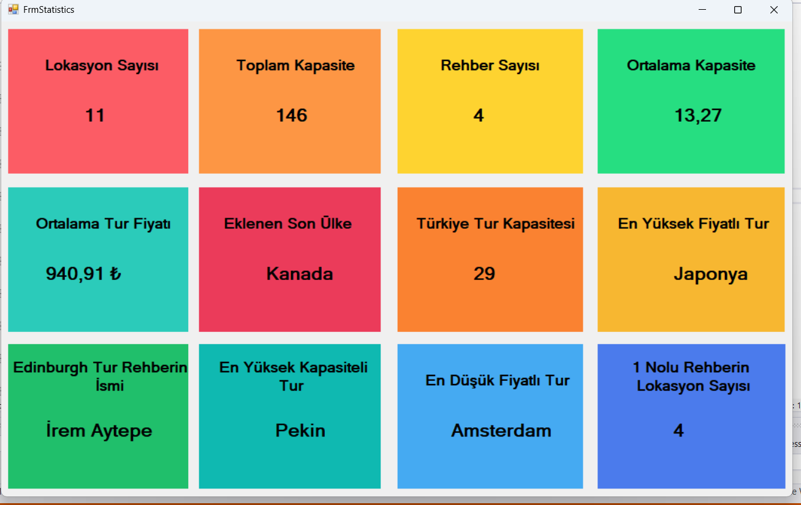

# 🎯 Ef Travel Db İstatistik Ekranı

SQL'de tur organizayonu database oluşturduk. Database'de Admin,Customer,Guide,Location tabloları mevcut Framework olarak EntityFramework database first yaklaşımını kullandık. SQL'deki sorguları LİNQ dilinin yardımıyla C# ile yazdık. Önce EfTravelDbEntities'den bir nesne örneği aldık. Bu SQL'deki tabloları temsil ediyor. Sonra her istatistik için LINQ sorgusu yazdık. Aşağıda bu şirkete ait istatistiklerin ekran görüntüsü ve bu istatistiklere ait açıklamalar vardır.

---



---

###  🛠️ Toplam lokasyon sayısı

Burada lokasyonları count() metodu ile sayarak label içine ekledim.

```C#
var locationCount = Db.Location.Count();

lblCount.Text = locationCount.ToString();
```

---

###  🛠️ Toplam kapasite sayısı

Burada location tablosundaki capacity verilerini SUM() metodu ile toplayıp ilgili label içine yazdım.

```C#
lblCapasity.Text = Db.Location.Sum(x => x.Capacity).ToString();
```

---

###  🛠️ Rehber sayısı

Burada COUNT() metodu ile guide tablosunu satır sayısını sayarak ilgili label içine yazdım.

```C#
lblGuide.Text = Db.Guide.Count().ToString();
```

---

###  🛠️ Ortalama Kapasite

Burada location tablosundaki turların ortalama kapasitesini AVARAGE() ile aldım. Yalnız Burada
sonuç ekrana virgülden sonra bol rakamlı çıktığı için ekrana sığmadığı için aşağıdaki gibi bir yol izledim.

```C#
lblAvgCapacity.Text = Db.Location.Average(x =>(double?)x.Capacity).GetValueOrDefault().ToString("F2");
```

---

###  🛠️ Ortalama tur fiyatı

Burada da AVARAGE() ile ortalama tur fiyatını aldım. Yine virgülden sonra bol rakam çıktığı için 
aşağıdaki gibi bir yol izledim.

```C#
lblAvgPrice.Text = Db.Location.Average(x => (double?)x.Price).GetValueOrDefault().ToString("F2") + " ₺";
```

---

###  🛠️ Eklenen son ülke

Burada ben OrderByDescending(x => x.LocationId) kullandım. Bu ID göre son ID'den ilk ID sıralama yapıyor. Yani tersten sıralıyor. Sonra FİRST() ile country sütunundaki ilk ülkeyi ilgili label yazdım. Ters çevirdiğim için en son giren ülkeyi ekrana yazdı.

```C#
lblAddLastCountry.Text = Db.Location.OrderByDescending(x => x.LocationId).Select
    (y => y.Country).First();
```

---

###  🛠️ Türkiye tur kapasitesi

Burada ülkesi Türkiye olan satırları seçip SUM() ile bu ülkelerin capacity değerlerini toplayıp
ilgili label yazdım.

```C#
lblTurkiyeCapacity.Text = Db.Location.Where(x => x.Country == "Türkiye").
    Sum(y => y.Capacity).ToString();
```

---

###  🛠️ En yüksek fiyatlı tur

Burada iç içe sorgu yazdım. Location tablosundaki price ile MAX() metodunu kullanarak en yüksek
fiyatlı turu bulup onun country sütunundaki ülkeye karşılık gelen değeri ilgili label yazdım.

```C#
lblMaxPriceCountry.Text = Db.Location.Where(x => x.Price == (Db.Location.Max(z => z.Price)))
    .Select(y => y.Country).FirstOrDefault();
```
---

###  🛠️ Edinburg gezisinin rehberinin ismi

Burada ilk önce edinburghGuideID isimli bir değişken oluşturup Edinburgh ait rehberin ID numarasını aldım.
Sonra Guide tablosundaki ID ile yukarıdaki değişkenden gelen ID karşılaştırdım. Eğer aynı ise Guide tablosundaki rehber adı ve soyadını ilgili label yazdım.

```C#
var EdinburghGuideId = Db.Location.Where(x => x.City == "Edinburgh").Select(y => y.GuideId).FirstOrDefault();

lblEdinburghGuideName.Text = Db.Guide.Where(z => z.GuideId == EdinburghGuideId).Select
    (w => w.GuideName + " " + w.GuideSurname).FirstOrDefault().ToString();
```

---

###  🛠️ En yüksek kapasiteli tur

En yüksek kapasiteli turu sıralayıp ters çevirdim. Böylece capacity değeri en başa geldi.
Sonra buna karşılık gelen şehri ilgili label yazdım.

```C#
lblMaxCapacityTour.Text = Db.Location.OrderByDescending(x => x.Capacity).Select(y => y.City).FirstOrDefault().ToString();
```

---

###  🛠️ En düşük fiyatlı tur

minPriceTour değişkeni oluşturup en düşük fiyatı belirledim. Sonra lokasyon tablosundaki fiyatla değişkenden geleni karşılaştırdım. Değerler aynı ise buna karşılık gelen city ilgili label yazdım.

```C#
var minPriceTour = Db.Location.Min(x => x.Price);

lblMinPriceTour.Text = Db.Location.Where(x => x.Price == minPriceTour).Select(y => y.City).FirstOrDefault().ToString();
```

---

###  🛠️ 1 numaralı ID sahip rehberin tur sayısı

Burada join ile location ve guide tablolarını birleştirdim. Sonra guide tablosundaki 1 nolu ID sahip rehberin isim ve soyisminin hangi değerler olduğunu atadım. Count() ile bu kişiye ait
lokasyonları sayıp bunları ilgili label yazdım.

```C#
lblSerelYereliLocationCount.Text = Db.Guide.Where(g => g.GuideName == "Serel" && g.GuideSurname == "Yereli").
    Join(
    Db.Location,
    Guide => Guide.GuideId,
    Location => Location.GuideId,
    (Location,Guide) => Location
    ).Count().ToString();
```

# 📖 CSharpEgitim Kampi

- Form uygulamaları üzerinde CRUD işlemlerinde yaptık. Entity Layer katmanında entitileri oluşturduk. 

---

- Data Access katmanında context sınıfını kullanarak CRUD işlemlerini gerçekleştirdik. 
    Burada EntityFramework kullandık.

---

- Business katmanında iş mantığı katmanı olarak CRUD işlemlerine köprü oluşturduk.

---

- Prensentation katmanında connection string ile SQL bulunan veri tabanımıza bağlandık ve oradaki verileri form uygulamalarında görüntüledik.

---

- EfProject katmanında istatistik formu oluşturduk. LİNQ dilini kullanarak veritabanından istatistik çektik.  


